<!-- PROJECT LOGO -->
<br><br>

<div align="center">

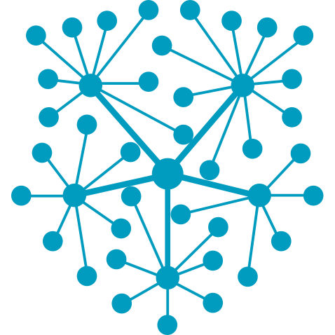
<h3 align="center" style="font-size: 22px;">DeFi Events Recording Project</h3>

<p style="font-size: 15px;">
    Live and historical recording of events emitted from Smart Contracts
</p>

&nbsp;
&nbsp;
&nbsp;
&nbsp;


<div style="font-size: 16px;" markdown="1">

[The Plan](./docs/0_Plan.md)
&nbsp;·&nbsp;
[Interim Update](./docs/1_Interim.md)
&nbsp;·&nbsp;
[Final Update](./docs/2_Final.md)

</div>

&nbsp;
&nbsp;


</p>

</div>

<br>

<div id="contents"></div>

<!-- TABLE OF CONTENTS -->
<details>
    <summary style="font-size: 20px;">Table of Contents</summary>
    <br>

- [0. Roadmap](#0-roadmap)
- [1. About the project](#1-about-the-project)
- [2. Development and Testing](#2-development-and-testing)
- [3. Getting Started](#3-getting-started)
  - [3.1. Environment variables](#31-environment-variables)
  - [3.2. Building and Running](#32-building-and-running)
  - [3.3. Run-time config files (optional)](#33-run-time-config-files-optional)
- [4. Exploration](#4-exploration)
  - [4.1. Swagger UI Docs](#41-swagger-ui-docs)
  - [4.2. Explore Live Recording Events](#42-explore-live-recording-events)
  - [4.3. RPC Call to Record Historical Events](#43-rpc-call-to-record-historical-events)
</details>


<br><hr><br>

<!-- CONTENTS -->
## 0. Roadmap
[<u>back to contents</u>](#contents)

- [x] Live-streaming of swap events
- [x] Processing of event data
- [x] Dockerizing and writing into database
- [x] Historical recording of swap events
- [x] API service

<br><br>

## 1. About the project
[<u>back to contents</u>](#contents)

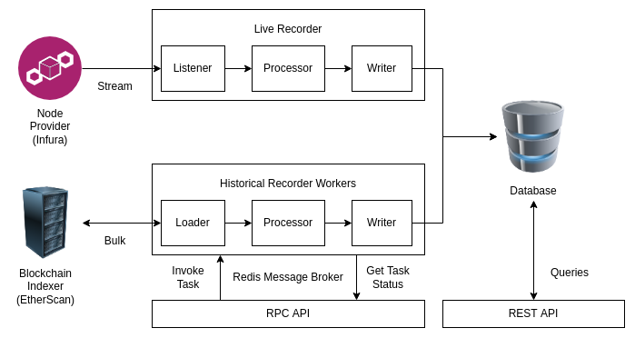


This project comprises the source code of

1. Live Recording Streaming Service in `services/recording/src/live`
2. Historical Batch Recording RPC API Service in `services/recording/src/historical`
3. RESTful API Interface Service in `services/interface/src`

NOTE: `1.` and `2.` have shared dependencies -- mainly the `src/events` module that provides event-specific handlers for each type of event.

<br>

<!-- omit in toc -->
#### Current supported events are:

1. Uniswap V3 Pool Contract's `Swap` event (event_id=`uniswap-v3-pool-swap`)

<br>

<!-- omit in toc -->
#### With the source code, we organize them with `docker-compose` with the following services:

1. `database` service
   - The MongoDB database
   - Exposed to host at port `27017` (accessible at `localhost:27017`)
2. `live` service
   - Live events recording
3. `redis` service
   - Message broker for historical batch recording tasks
4. `historical-rpc-api` service
   - RPC endpoints to invoke the tasks
5. `historical-workers` service
   - Celery workers to execute the tasks
6. `interface`  service
   - RESTful endpoints for reading from the database
7. `proxy` service
   - Nginx proxy to route `RPC` and `RESTful` calls to the respective services
   - Exposed to host at port `80` (accessible at `localhost:80` or just `localhost`)

We can further categorize them as such:

1. The database
2. Live Recording
   - `live` service
3. Historical Recording (RPC API)
   - `redis` service
   - `historical-rpc-api` service
   - `historical-workers` service
4. RESTful API
   - `interface` service
5. Proxy for API routing
   - `proxy` service

<br>

<!-- omit in toc -->
#### Refer to the plan and updates for further details:

- [The Plan](./docs/0_Plan.md)
- [Interim Update](./docs/1_Interim.md)
- [Final Update](./docs/2_Final.md)

<br><br>

## 2. Development and Testing
[<u>back to contents</u>](#contents)

It is assumed that Python version `>=3.9` and package manager `pip` is already set up on your machine.

NOTE: Version should be >= 3.9 to facilitate type-hinting with native types.

<br>

<!-- omit in toc -->
#### Create and use a virtual environment (optional but recommended)
```shell
$ python -m venv venv
$ source venv/bin/activate
```

<br>

<!-- omit in toc -->
#### Install dev dependencies
```shell
$ pip install -r dev_requirements.txt
```

<br>

<!-- omit in toc -->
#### Running linting (flake8), type-checking (MyPy), and tests (PyTest)

Use the provided shell script:
```shell
$ sh bin/run_all_tests.sh
```
Or individually `cd` into the `services/interface` and `services/recording` directories to run:
```shell
$ flake8 . --count --exit-zero
$ mypy --install-types --non-interactive .
$ pytest .
```

<br><br>

## 3. Getting Started
[<u>back to contents</u>](#contents)

### 3.1. Environment variables
Before using, we need to specify some environment variables. The template can be found in `.env.template`. Simply copy the contents into a `.env` file in the root directory of the project and fill in the values for them. 

NOTE: Do **NOT** change these 2 values if running on the same machine with the default `docker-compose.yaml` configurations. 
```env
DB_HOST=database
DB_PORT=27017
```
- `DB_HOST=database` refers to the name of the database service as per the `docker-compose.yaml` configuration. 
- `DB_PORT=27017` refers to the default port for `MongoDB` since we do not change it as per the `docker-compose.yaml` configuartion.

An example of the `NODE_PROVIDER_RPC_URI` and `NODE_PROVIDER_WSS_URI` are
- `https://mainnet.infura.io/v3/<my-infura-api-key>`
- `wss://mainnet.infura.io/ws/v3/<my-infura-api-key>`

<br>

### 3.2. Building and Running
To run the services, we use `docker-compose`. Build it and run it with:
```shell
$ docker-compose build
$ docker-compose up
```

<br>

### 3.3. Run-time config files (optional)
While the default run-time configurations are already provided, we have the option to can change them by looking into the `configs` directory, for both `live` and `historical` recording.

The live recording configurations include:
- `gas_pricing`
  - `gas_currency`
    - e.g., ETH for Uniswap
  - `quote_currency`
    - e.g., USDT by default
- `subscriptions` (array of subscriptions)
  - `contract_address`
    - The address of the contract to subscribe to
    - e.g. `0x88e6A0c2dDD26FEEb64F039a2c41296FcB3f5640` for the `USDC-WETH` Uniswap V3 Pool
  - `event_id`
    - e.g., `uniswap-v3-pool-swap` for Uniswap V3 Pool's `Swap` events, which helps to recognize the event type and thus, the event handler.

The historical recording configurations include
- `gas_pricing`
  - `gas_currency`
    - e.g., ETH for Uniswap
  - `quote_currency`
    - e.g., USDT by default

NOTE: These config files are currently loaded into the containers with `docker volumes`. Simply stop the containers and restart them to update.

<br>

## 4. Exploration
[<u>back to contents</u>](#contents)

Once the services are up and running, we can head over to the welcome page @ `http://localhost` (i.e., `http://localhost:80`):

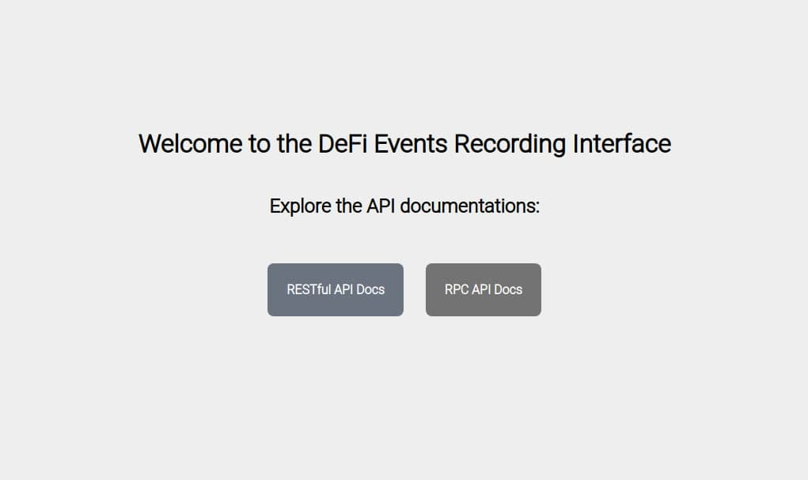

<br>

### 4.1. Swagger UI Docs

From here, we can navigate to either the RESTful API Docs or RPC API Docs (recall they are two separate service, merely proxied by Nginx).


REST API Docs:

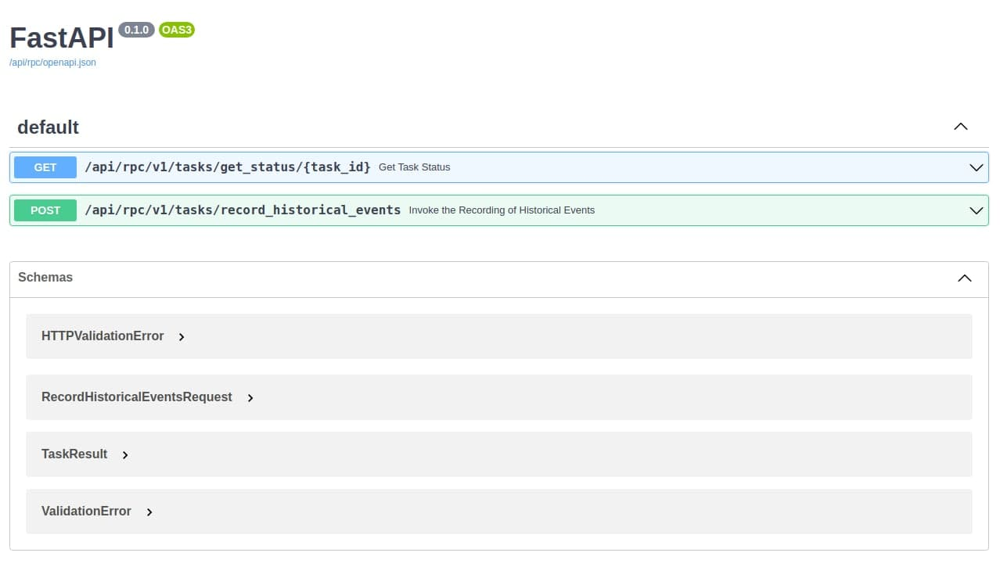


RPC API Docs:

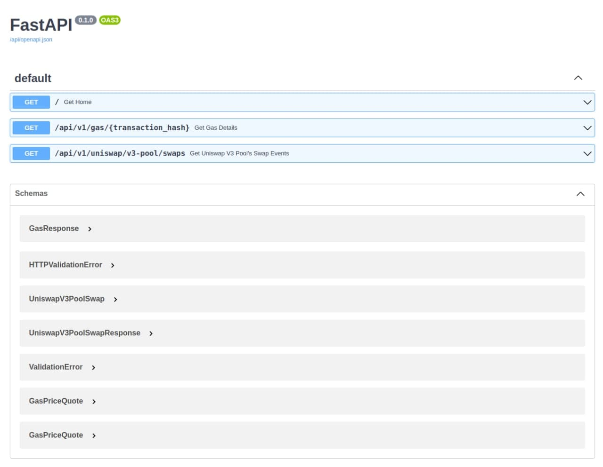

<br>

### 4.2. Explore Live Recording Events

While we were busy exploring the documentations, the `live` recording service had started recording live data:

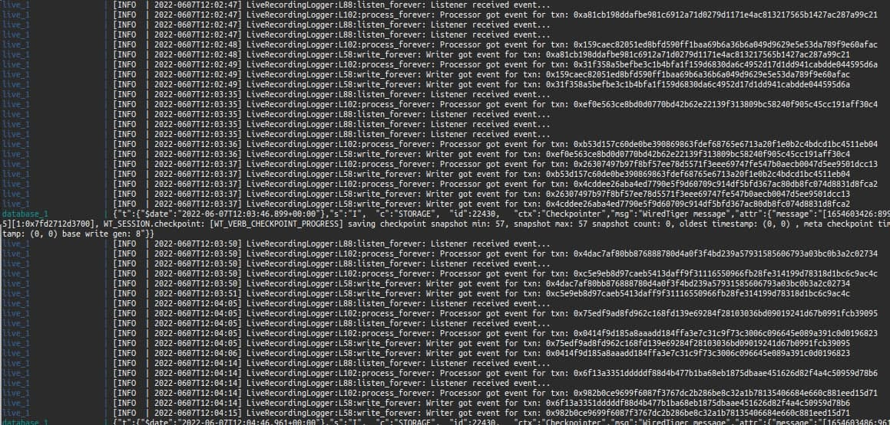

<br>

Say we are interested in transaction hash `0xa81cb198ddafbe981c6912a71d0279d1171e4ac813217565b1427ac287a99c21`, the first one logged out in the above image, we can make a `GET` request to the REST API:

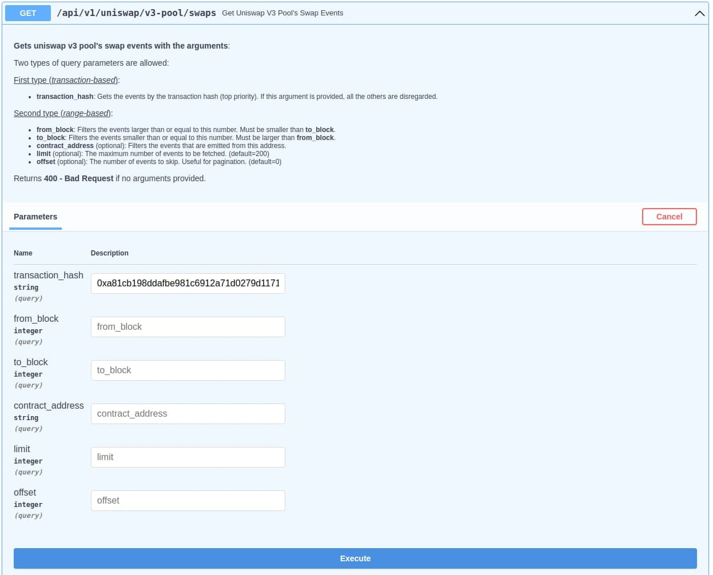

and *voila*! We get our response:

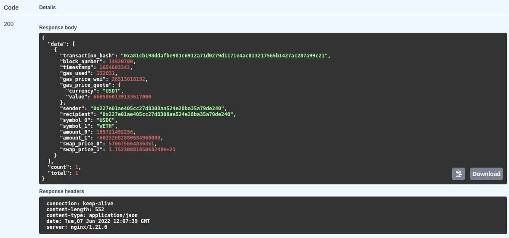

<br>

Alternatively, if we are only interested in the transaction gas fees, we make a call to the `gas` route:

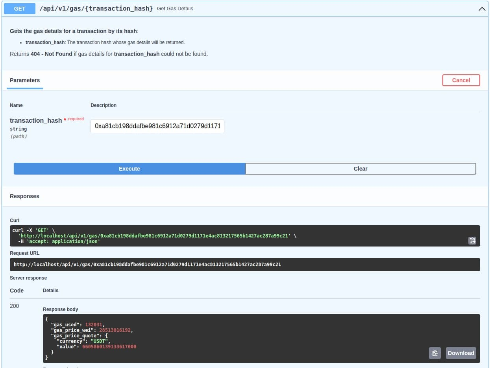

<br>

### 4.3. RPC Call to Record Historical Events

Now, let's say we are interested in events that had been emitted by the `USD-WETH` Uniswap V3 Pool contract in the past, say from block height = `14900000` to `14910000`. We shall use the RPC API to invoke a historical batch recording task:

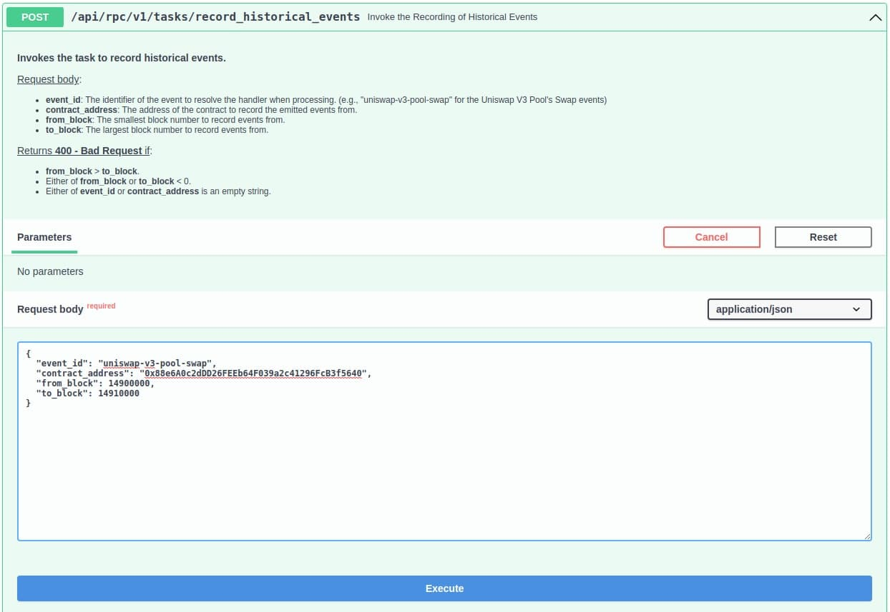

<br>

We should get back the `task_id`:

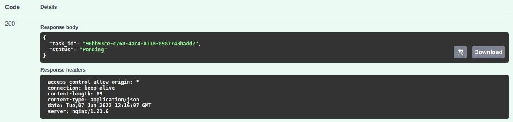

<br>

If we try to get the status of the task immediately, we'll see that it is still pending... (of course)

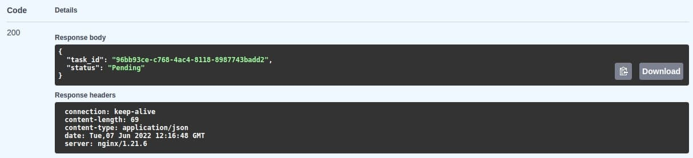

<br>

Then we see the logs that the task has indeed started running:

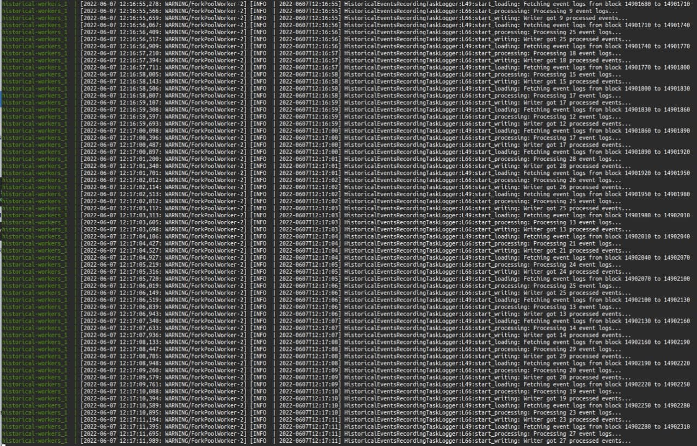

<br>

After some time, we try to get the status of the task again and see that it had completed:

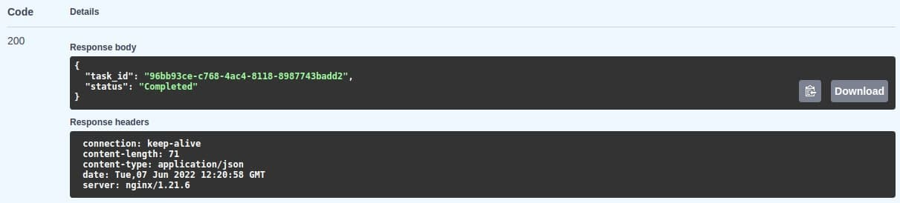

<br>

Now, suppose we are interested in a swap event from block `14900020`, as seen on EtherScan:

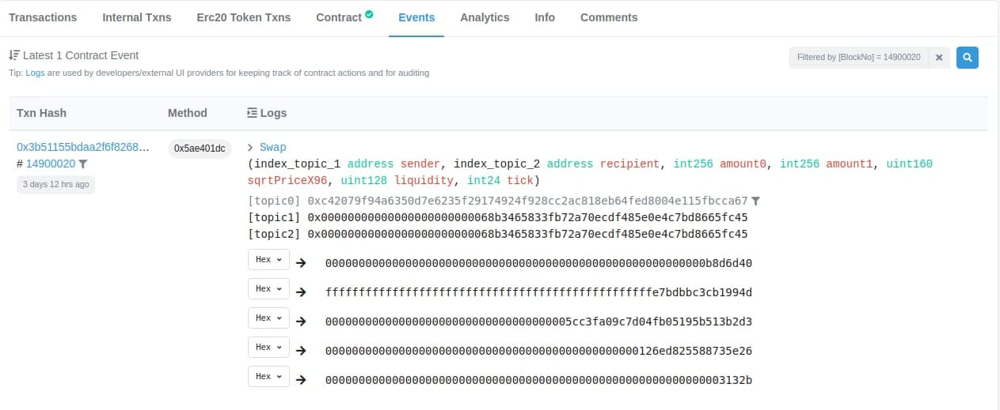

<br>

And its corresponding transaction whose hash is `0x3b51155bdaa2f6f8268445a7bb5d7e1abc8ea983be34b7e3dcc592c9a3f230c7`:

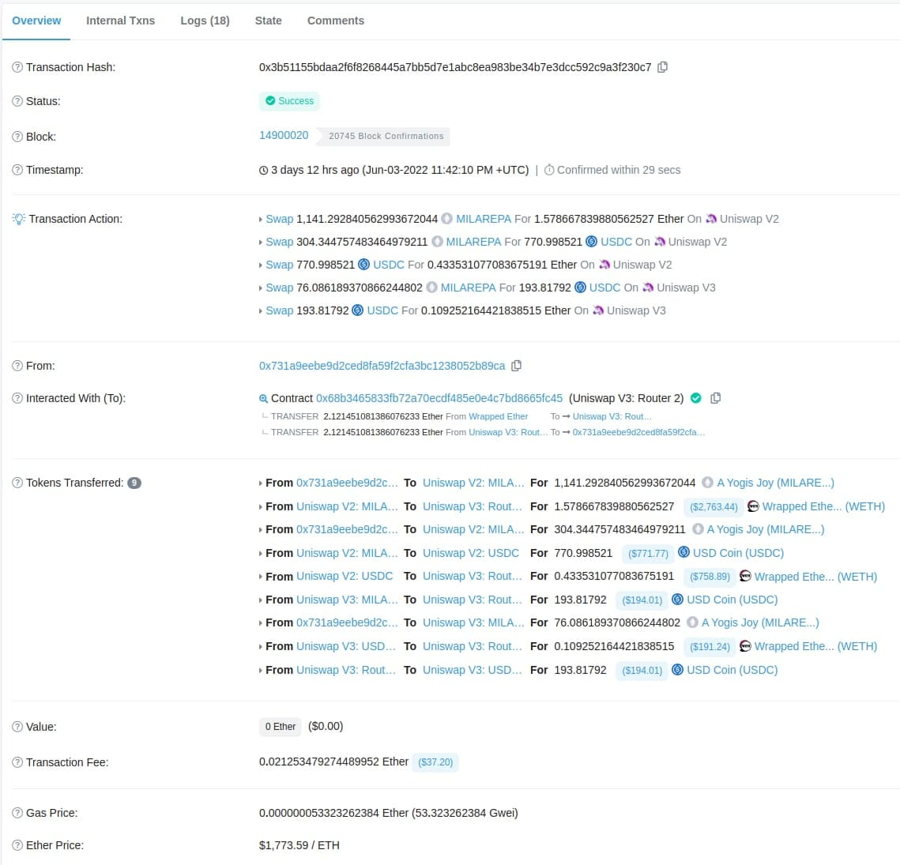

<br>

We can head back to the REST API to retrieve the details for this transaction:

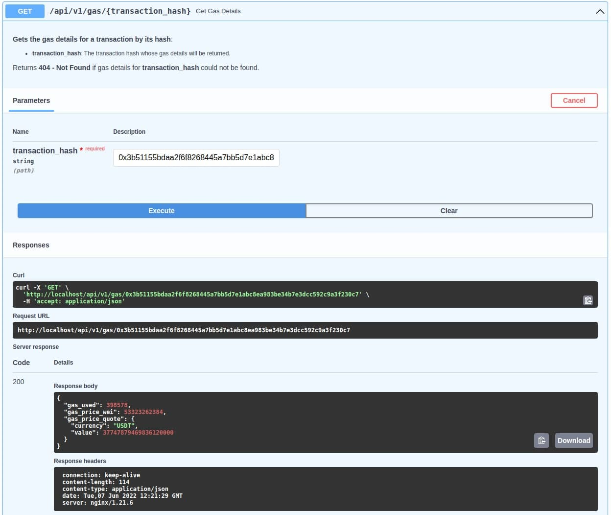


We see that we have correctly recorded that
- `gas_used` = `398578` units
- `gas_price` = `53323262384` wei (`53.323262384` gwei)
- `gas_price` = around `37.74` USDT

<br>

To get more details, we can also get the entire swap event's data from the `swaps` endpoint:

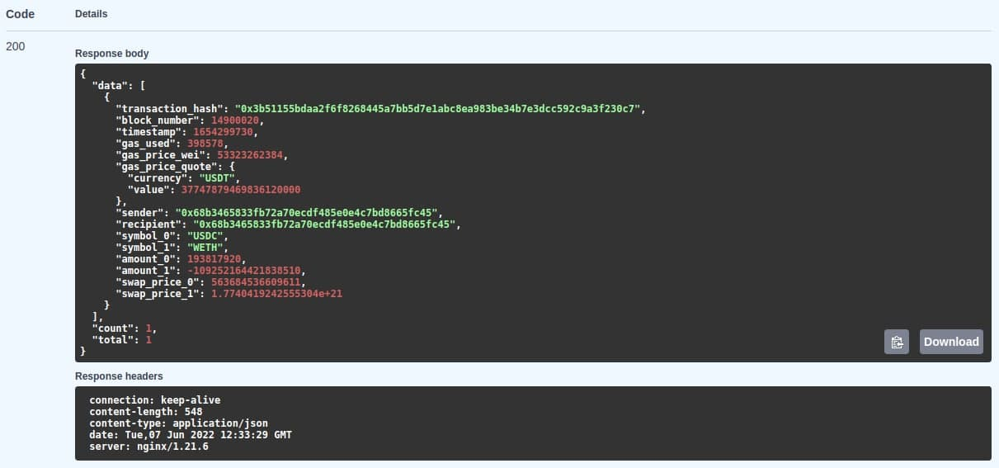

We see that we have also recorded the swap prices:
- `swap_price_0` - Price of `token_0` quoted in `token_1` (`0.000563684536609611` WETH per USDC)
- `swap_price_1` - Price of `token_1` quoted in `token_0` (roughly `1774.04192` USDC per WETH)

Something to note is that, as we have seen previously in the screenshot of the transaction from EtherScan, a transaction can comprise multiple swap events. As such, the response is an array of the results. If we were to also record the other events, we would be able to see the other events in the same response.
