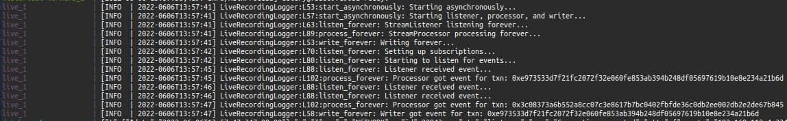
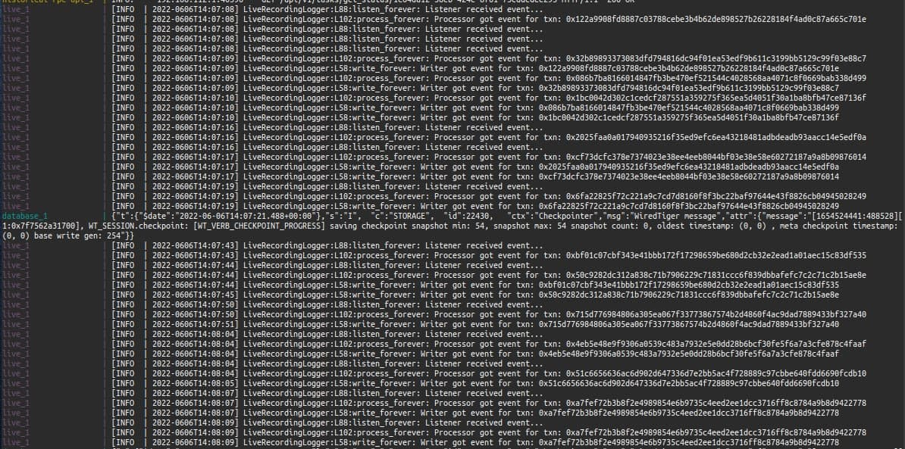
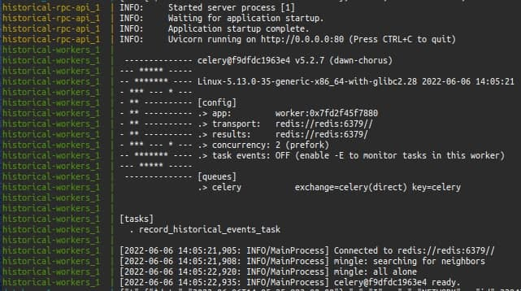
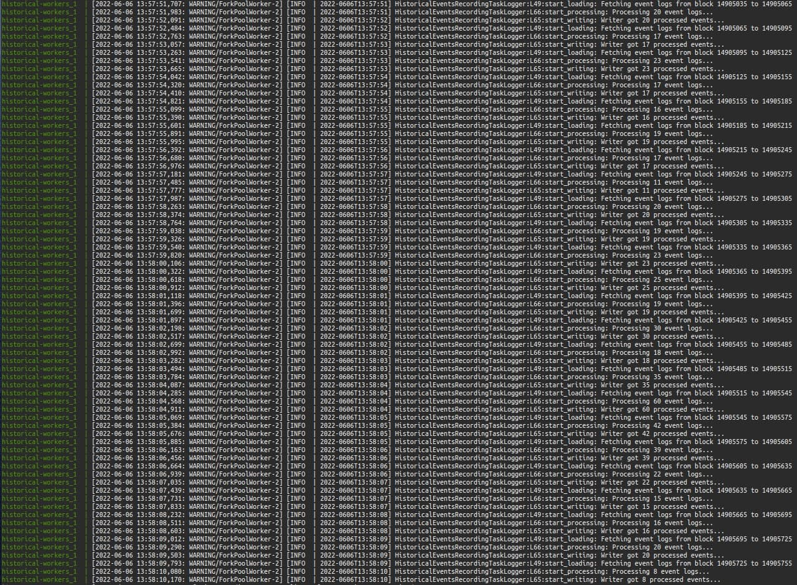

<!-- omit in toc -->
# Interim Update

## The Stream

We have successfully written a stream to listen to events from the chain and have recorded them into the database.

 

On starting the stream, this is what we should see:

 

After which, the stream will continue like this:

  

## The Historical Batch Recorder

We have also successfully written a batch recorder to record events queried from EtherScan into the database. This can be invoked via a `POST` request to the RPC endpoint `/api/v1/tasks/record_historical_events`, with the body containing the parameters:
- `event_id`
- `contract_address`
- `from_block`
- `to_block`

For the case of the specific USDC-WETH pool, the `event_id` will be `uniswap-v3-pool-swap` and the `contract_address` will be `0x88e6A0c2dDD26FEEb64F039a2c41296FcB3f5640`.

Note: we are using Redis to queue the tasks and Celery to handle them, with the RPC endpoint exposed with FastAPI.

 

On starting the service, this is what we should see:

 

When the endpoint is invoked, we will get a flow of logs of the batches being processed:

 

From the caller's perspective, the response will be a simple JSON containing the `task_id` and the initial status of `Pending`:

`{'task_id': '1c64da12-38eb-424e-8f61-73eddedee295', 'status': 'Pending'}`

After some time, the caller can call `/api/v1/tasks/get_status/{task_id}` to get the status update. The status will be one of:

- `{'task_id': '1c64da12-38eb-424e-8f61-73eddedee295', 'status': 'Pending'}`
  - if it is still running
- `{'task_id': '1c64da12-38eb-424e-8f61-73eddedee295', 'status': 'Completed'}`
  - if it has successfully completed
- `{'task_id': '1c64da12-38eb-424e-8f61-73eddedee295', 'status': 'Failed'}`
  - if it has failed
